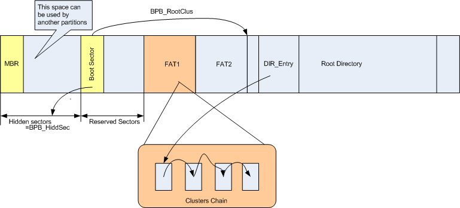

# FAT文件系统知识概览

文件，其实就是数据。数据在计算机内以 0/1 表示，最基本的单位是bit（比特）。8 bit = 1 Byte，1024 Byte = 1 KB，1024 KB = 1 MB，如此如此。文件内容也是若干01串的组合。在读写文件的时候，我们会调用 kernel 中的函数 read()/write()，它们接受文件的描述符，然后读/写指定长度的数据。所有数据也都是 0/1 的形式，只不过我们在运用这些函数的时候，这些数据被转成了更加高级的表示，例如 char，int 或者其他类型。

## 磁盘是什么

现在的硬盘容量已经达到了TB的级别，它们的物理实现与原理又是怎样的呢？我就简单地带过一下，具体细节可以去 [How a hard disk work?](http://www.explainthatstuff.com/harddrive.html)，里面很简洁地说明了他的工作原理。

磁盘最重要的就是扇面，扇面上面有一圈圈的磁道，这些磁道中储存着信息。如何进行读写呢？物理层面上，是通过用磁头改变磁道中每个存储单元的极性来实现的。

磁盘中的物理储存单位叫做sector(扇区)，而文件系统中一个储存单位叫做 block (FAT 系统叫 cluster)，每一个 cluster 对应1到多个扇区。维基上有更详细的解释 [Disk Sector](https://en.wikipedia.org/wiki/Disk_sector)

## FAT32 的文件存储

平常操作文件的时候，例如你打开一个 doc 文件，增加一些内容然后保存，或者删除某个文件到回收站，它们的内部操作是如何实现的呢？不同的文件系统有不同的实现方式。但所有的操作都离不开存储作为基础，问题来了：如何设计一个文件系统，让它既能高效读写文件，又能快速对文件定位？

我们来看看最原始的想法：直接连续添加，也就是把文件一个挨着一个地加到储存空间（硬盘）中去。但是，这样实现，既不利于查找，也不利于删除、添加与修改。想一想，如果把一些文件删除，就会产生缺口，再次添加文件的时候，单独的缺口可能不足以容纳新的文件，从而产生浪费。而且只要查找某个文件，就需要遍历所有的文件结构，这个是要花相当长的时间。

我们来看一看 FAT32 的实现方式：它将储存空间分成了一个个小块( cluster ),存储文件的时候，会把文件切分成对应长度的小块，然后填充到硬盘中去：

这样一来，我们就不用担心文件太大以至于不能放进缺口中，因为我们可以把一部分小块放在一个缺口，把另一部分小块放在另外的地方，这样很高效地利用了磁盘的空间。

第二个概念，FAT32  采用了链表的数据结构。也就是说，磁盘中的每一个 cluster 都是链表中的一个节点，它们记录着下一个 cluster 的位置（next pointer）。什么叫下一个 cluster？如果一个文件被放在了储存空间中，如果他所占用了超过一个cluster，那么我们就需要把这些cluster连接起来。FAT32中，只记录了每一个文件开始的cluster，所以我们需要用链表来完成访问整个文件的操作。

用来存储这个链表信息的表格叫做 FAT ( FILE ALLOCATE TABLE )  ,真正存放数据的地方与FAT是相互分离的。FAT的作用就是方便查找。

接下来我们看看，删除的操作。这会引出另一个专有结构：FILE ENTRY

首先你来回想一下，删除文件和写入一个新的文件（比如复制粘贴），哪个更快些？删除。几乎是互逆过程，为何时间不同？实际上，在你删除文件的时候，文件系统并没有真正地把数据从磁盘上抹去（这也是为什么我们有希望恢复删除文件的原因），而只是修改了它的FILE ENTRY信息。

何谓 FILE ENTRY？ 简单些讲，就是记录文件属性的一个小结构。它们被统一存储在 ROOT DIRECTORY 中。我们先看一下 FAT32 的磁盘整体面貌



我们先忽略最前面的几个 sector，从 FAT 看起。一个 FAT 系统有若干个 FAT 结构（因为磁盘大小不同，所需要的链表节点数也不同），紧挨FAT区域的是ROOT DIRECTORY,它是整个磁盘的目录结构，而这之中存储的就是我们说的FILE ENTRY,也就是每个文件的属性。ROOT DIRECTORY后，才是真正地DATA FIELD，用来存储真正地文件内容。

在我们查看某个文件信息而非打开它时，我们并不需要直接访问文件的数据。文件系统会在ROOT DIRECTORY找到相应的FILE ENTRY，然后把相关信息显示出来。这包括：文件名，创建、修改时间，文件大小，文件的第一个cluster的位置，只读/隐藏等等。请注意，文件夹在文件系统中也表示成一个文件，也有相应的FILE ENTRY，只是他们储存的是一批文件而已 ( FILE ENTRY 中会有相应的标志显示是否是文件夹)。

回到我们删除文件的话题，当一个文件被删除的时候，系统会找到相应的 FILE ENTRY，把文件名第一个字符改为 0xE5 ——完毕。就是这么简单，只是把文件属性修改，一点内部数据都没有改动。这时候如果我们再添加一个文件进去，由于系统会通过查找 ROOT DIRECTORY 来确定可用的空间，因此如果发现一些 FILE ENTRY 文件名是未分配或者已经删除的标志，那么对应的 cluster 就会被占用。但是在被覆盖之前，这些删除的文件依然存在在你的硬盘里（只是你丢失了如何获取他们信息的渠道）。这就是为什么删除要更快些。

## BPB(BIOS Paramter Block)

在 FAT 文件系统中最重要的数据结构之一为 BPB(BIOS Parameter Block), 它储存了 FAT 文件卷重要的配置参数。BPB被放置在 boot sector(引导扇区) 结构之中，引导扇区通常被称为 VBR(Volume Boot Record) 或者 PBR(Private Boot Record)，但是它仅仅是保留区和数据卷的第一个扇区。

我们使用如下结构来描述 BPB 的结构：

```rust
pub struct BiosParameterBlock {
    pub(crate) bytes_per_sector: u16,
    pub(crate) sectors_per_cluster: u16,
    pub(crate) reversed_sector: u16,
    pub(crate) fats: u8,
    pub(crate) root_entries: u16,
    pub(crate) total_sectors_16: u16,
    pub(crate) media: u8,
    pub(crate) sectors_per_fat_16: u16,
    pub(crate) sectors_per_track: u16,
    pub(crate) heads: u16,
    pub(crate) hidden_sectors: u32,
    pub(crate) total_sectors_32: u32,

    // Extended BIOS Paramter Block
    pub(crate) sectors_per_fat_32: u32,
    pub(crate) extended_flags: u16,
    pub(crate) fs_version: u16,
    pub(crate) root_dir_first_cluster: u32,
    pub(crate) fs_info_sector: u16,
    pub(crate) backup_boot_sector: u16,
    pub(crate) reserved_0: [u8;12],
    pub(crate) drive_num: u8,
    pub(crate) ext_sig: u8,
    pub(crate) volume_id: u32,
    pub(crate) volume_label: [u8;11],
    pub(crate) fs_type_label: [u8;8]
}
```

由于启动扇区位于数据卷第0个簇( cluster )，因此我们只需将其读出来并按照内存布局读取相应的域即可，不需要传入对应的位置。

**BIOSParameterBlock 一些 field 的说明：**

| Name                | Description                                                  |
| ------------------- | ------------------------------------------------------------ |
| bytes_per_sector    | 每个sector 的字节数，仅适用以下值：512/1024/2048/4096        |
| sectors_per_cluster | 每个 cluster 中的 sector 数， 此值必须是2的幂，合法值为2/4/8/16/32/64/128，不能另每个 cluster 的字节数大于32K |
| reserved_sector     | 从卷的第一个 sector 开始的 voulme 保留区域中的保留 sector 数目，该字段不得为0，对于 FAT32 来说，此值通常为32。 |
| fat_nums            | 在 volume 上 FAT32 sector 的计数，理论上任何大于等于1的值都有效，但推荐设置为2 |
| root_entry_cnt      | 对于 FAT32 来说此值应设置为0                                 |
| fat_size            | 对于 FAT32 来说此值应为32（每个 FAT entry 有32 bits）        |
| root_cluster        | root cluster 的 cluster 号， 仅在 FAT32 文件系统中存在，通常设置为2， 但不强制要求为2 |
| root_dir_sector     | 0                                                            |
| volume_id           | volume id，通过该值与 volume_label 一起可支持可移动媒体上的卷跟踪，这些值允许 FAT 文件系统驱动程序检测到错误的磁盘插入到可移动驱动器中，这个 ID 是通常简单地将当前时期和时间组合成一个32位的值来生成 |
| volume_label        | 该字段与在根目录中的11字节的 volume label 相匹配。FAT 文件系统驱动程序应确保在根目录中的 volume label 更改或创建其名称时更新此字段。 当没有卷标时，此字段的设置是字符串 "No Name" |


## Root Directory

在获得 boot sector 的信息后，我们就可以读取 Root Directory的结构了。由于在 boot sector 中已经有了 FAT 占用 cluster 总数以及 reserved clusters 总数的信息，因此我们可以越过前面这些簇找到 Root Directory, 因此在我们的实现中定义了如下方法：

```rust
    /// Get the first sector offset bytes of the cluster from the cluster number
    pub(crate) fn offset(&self, cluster: u32) -> usize {
        ((self.reversed_sector as usize)
        + (self.fats as usize) * (self.sectors_per_fat_32 as usize)
        + (cluster as usize - 2) * (self.sectors_per_cluster as usize))
        * (self.bytes_per_sector as usize)
    }
```


## FAT and Cluster

FAT(File Allocate Table) 是另一个重要的组成部分， 这个部分使用链表描述了一个文件的扩展信息。这个结构的作用是定义一个文件范围（簇链）的链表。 请注意，directroy 和 file 都包含在文件中，在 FAT 上没有什么不同。 目录实际上是一个具有特殊属性的文件，表明其内容是目录表。

数据区被分成称为簇的一定数量的扇区块，数据区在这个单元中进行管理。 FAT 的每一项都与数据区中的每个簇相关联，FAT 值表示相应簇的状态。 但是，前两个 FAT 项 FAT[0] 和 FAT[1] 是保留的，不与任何簇相关联。 第三个 FAT 项 FAT[2] 是与数据区第一个簇关联的项，有效簇号从2开始。

FAT 通常是为了冗余而复制的，因为任何 FAT 扇区的损坏都会导致严重的数据丢失。 BPB_NumFATs 表示的 FAT 副本数和 FAT 区域的大小变为 `fat_nums * sectors_per_fat_32`。 FAT 驱动程序通常只引用第一个 FAT 副本，并且对 FAT 项的任何更新都反映在每个 FAT 副本中。

FAT 卷上的文件由目录管理，即 32 字节目录项结构的数组。 目录条目的详细信息如下所述。 目录条目具有文件数据的文件名、文件大小、时间戳和第一个簇号。 簇号是跟随文件数据簇链的入口点。 如果文件大小为零，则第一个簇号设置为零，并且没有数据簇分配给该文件。

如上所述，簇号0和1是保留的，有效簇号从2开始。簇号2对应数据区的第一个簇。 因此，在具有 N 个簇的卷中，有效的簇号是从 2 到 N+1，FAT 条目的数量是 N+2。 数据簇 N 的位置计算如下：

```
FirstSectorofCluster = DataStartSector + (N - 2) * BPB_SecPerClus;
```

如果文件大小大于扇区大小，则文件数据跨越集群中的多个扇区。 如果文件大小大于簇大小，则文件数据跨越簇链中的多个簇。 FAT 条目的值表示后面的簇号（如果存在），以便可以通过跟随簇链到达文件中的任何字节偏移量。 集群链不能向后跟踪。 具有簇链最后一个链接的 FAT 条目具有一个特殊值（链尾、EOC、标记），它永远不会匹配任何有效的簇号。 每个FAT类型的EOC标志如下：

- FAT12: 0xFF8 - 0xFFF (通常为 0xFFF)
- FAT16: 0xFFF8 - 0xFFFF (通常为 0xFFFF)
- FAT32: 0x0FFFFFF8 - 0x0FFFFFFF (通常为 0xFFFFFFF)

还有一个特殊值，坏簇标记。坏簇标志表示簇中有缺陷扇区，不能使用。在格式化、表面检查或磁盘修复中发现的坏簇作为坏簇标记记录在 FAT 中。坏簇标记的值对于 FAT12 为 0xFF7，对于 FAT16 为 0xFFF7，对于 FAT32 为 0x0FFFFFF7。

坏簇标记的值永远不会等于 FAT12/16 卷上的任何有效簇号。但是，它可以等于任何可分配的簇数，因为 FAT32 中未定义簇的最大计数。此类 FAT32 卷可能会使磁盘实用程序混淆，因此您应避免创建此类 FAT32 卷。因此，FAT32 卷的簇数上限实际上是 268435445（大约 256 M 个簇）。

由于实施原因，某些系统对最大集群数有限制。例如，Windows9X/Me 支持最大 16 MB 的 FAT 大小，并且它限制了最大大约 4 M 簇的簇数。

每个可分配的 FAT 条目 FAT[2] 及其后的初始值为零，这表示该簇未在使用中并且可用于新的分配。如果该值不为零，则表示集群正在使用或已损坏。 FAT12/16 卷中的任何位置都不会记录空闲簇计数，需要完整的 FAT 扫描才能获取此信息。 FAT32 支持 FSInfo 来存储空闲簇数，以避免由于其非常大的 FAT 结构而进行全 FAT 扫描。

前两个 FAT 条目 FAT[0] 和 FAT[1] 是保留的，不与任何簇相关联。这些 FAT 条目在创建卷时初始化，如下所示：

- FAT12:  FAT[0] = 0xF??; FAT[1] = 0xFFF
- FAT16:  FAT[0] = 0xFF??; FAT[1] = 0xFFFF
- FAT32:  FAT[0] = 0xFFFFFF??; FAT[1] = 0xFFFFFFFF

?? FAT[0] 的值与 BPB_Media 的值相同，但该条目没有任何功能。 FAT[1] 中的一些位记录错误历史。

卷脏标志：（FAT16：bit15、FAT32：bit31）：启动时清除，干净关闭时恢复。启动时已清除表示脏关机和卷中可能出现逻辑错误。
硬错误标志：（FAT16：bit14、FAT32：bit30）：在不可恢复的读/写错误时清除，表示需要进行表面检查。
这些标志表示卷上有错误的可能性。一些支持此功能的操作系统会在启动时检查这些标志并自动启动磁盘检查工具。 Windows 9X 系列使用这些标志。 Windows NT 系列不使用这些标志，而是使用 BPB 中的替代品。

关于 FAT 区域还有两个更重要的事情。一个是 FAT 的最后一个扇区可能没有被完全使用。在大多数情况下，FAT 在扇区的中间结束。 FAT 驱动程序不应该对未使用区域有任何假设。它应该在格式化卷时用零填充，之后不应更改。另一个是BPB_FATSz16/32可以指示一个大于体积要求的值。在其他病房中，未使用的扇区可以跟在每个 FAT 之后。这可能是数据区对齐或其他原因的结果。此外，这些扇区在格式化时用零填充。

下表显示了 FAT 值的范围和每种 FAT 类型的含义:

| FAT12         | FAT16           | FAT32                   | 意义                     |
| ------------- | --------------- | ----------------------- | ------------------------ |
| 0x000         | 0x000           | 0x00000000              | 自由                     |
| 0x001         | 0x0001          | 0x00000001              | 保留                     |
| 0x002 - 0xFF6 | 0x0002 - 0xFFF6 | 0x00000002 - 0x0FFFFFF6 | 使用中（下一个链接的值） |
| 0xFF7         | 0xFFF7          | 0x0FFFFFF7              | 坏簇                     |
| 0xFF8 - 0xFFF | 0xFFF8 - 0xFFFF | 0x0FFFFFF8 - 0x0FFFFFF  | 使用中（链尾部）         |

**Note:**

```
data_sectors = total_sectors - (reserved_sectors_cnt + (fat_nums * fat_size)) -2 ?
count_of_clusters = data_sectors / sectors_per_clusters
```

```
fat_offset = N * 4(N为簇号)
fat_sectors_offset = reserved_sectors_count + (fat_offset / bytes_per_sectors)
fat_entry_offset = fat_offset % bytes_per_sectors
```

FAT32 Entry 的高4 bit 是不被使用的。

我们知道，FAT32 文件系统数据簇的前两个簇被设置为保留的簇，那么FAT 的前两个 entry 应当被设置为什么呢？对于FAT32 文件系统来说，FAT[0] = 0x0FFFFFF8，第二个保留簇 FAT[1] 由 FORMAT 设置为 EOC 标志，对于 FAT32 来说，文件系统驱动程序可以使用 FAT[1] entry 高两位作为脏卷标志（所有其他位始终设置为1）。

clean_shut_bit_mask = 0x080000000;

- bit 为 1 表明clean
- bit 为 0 表明 dirty

hard_err_bit_mask = 0x04000000；

- bit 为 1 表明 没有磁盘IO错误
- bit 为 0 表明发生了磁盘IO错误


## FAT Volume Initialization


## FAT Directory Structure

FAT 目录是一个文件，由一个32 bytes 所组成的线性表组成。而根目录是一个较为特殊的存在。

对于 FAT32 来说， 根目录是可变大小并且是一个簇链，这点和其他的目录项相同。 FAT32 volume 根目录第一个簇存储在 root_cluster 中， 任何 FAT 类型上的根目录本身都没有任何日期或时间戳，没有文件名（隐含文件名 “/” 除外），也不包括"." 和 ".."。 根目录的一个特殊之处在于他的文件设置了 volume_id_attr 属性的标志位。

| 域                  | 偏移量 | 大小 | 描述 |
| ------------------- | ------ | ---- | ---- |
| name                | 0      | 11   |      |
| attribute           | 11     | 1    |      |
| NT_reverse          | 12     | 1    |      |
| creation_time_tenth | 13     | 1    |      |
| creation_time       | 14     | 2    |      |
| creation_date       | 16     | 2    |      |
| last_access_date    | 18     | 2    |      |
| first_cluster_high  | 20     | 2    |      |
| write_time          | 22     | 2    |      |
| write_date          | 24     | 2    |      |
| first_cluster_low   | 26     | 2    |      |
| file_size           | 28     | 4    |      |

**Note**

name[0] = 0xE5, 表明该目录项是空的

name[0] = 0x00, 同样表明目录项为空，同时目录项的剩余部分都为空

name[0] = 0x05，表明该目录项表示为 0xE5 的字符

接下来字符在 dir_name 中无效：

- 小于 0x20 除了0x05
- ·0x22, 0x2A, 0x2B, 0x2C, 0x2E, 0x2F, 0x3A, 0x3B, 0x3C, 0x3D, 0x3E, 0x3F, 0x5B, 0x5C, 0x5D, a和 0x7C. 

当 attribute 字段为 ATTR_DIRECTORY 时表明该 entry 为一个目录 (0x10)，此时应设置 file_size 属性为0表明 file_size 不被使用，通过跟随它的 cluster 直到找到 EOC标志。  

一个簇分配给该目录，然后将first_cluster_low 和 first_cluster_high 设置为该簇号，并在 FAT 的该簇条目放置一个 EOC 标记。接下来，将该簇的所有字节初始化为0，如果该目录不是根目录，如果该目录不是根目录，你需要在该目录的前32字节的 Directory Entry (即刚刚分配的 cluster 的数据区域的前2个32字节区域)创建两个特殊条目。  

这两个目录条目即为 '.' 和 '..'。

## FAT Long Directory Entries

每个长目录项必须和一个短目录项进行配合使用  

| 域                | 偏移量 | 大小 | 描述                                    |
| ----------------- | ------ | ---- | --------------------------------------- |
| dir_order         | 0      | 1    |                                         |
| dir_name1         | 1      | 10   | 长目录项名字第一到第五个字符            |
| dir_attr          | 11     | 1    | 必须为Attr_Long_Name                    |
| dir_type          | 12     | 1    | 若为0则表示该目录条目为目录条目的子组件 |
| dir_checksum      | 13     | 1    | 长目录末尾的短目录项名称的校验和        |
| dir_name2         | 14     | 12   | 6-11字符                                |
| first_cluster_low | 26     | 2    | 必须为0                                 |
| dir_name3         | 28     | 4    | 12-13字符                               |

为了兼容型设计，长目录条目与短目录条目必须成对出现，并且在长目录条目在物理上在短目录条目之前并且连续。  

首先，一组目录长条目的每个成员都被唯一编号，并且该组的最后一个成员是 dir_ord 并且带有一个标志，表明它是该组的最后一个成员。dir_ord 字段用于此进行确定，集合的一个成员的 dir_ord 值设置为1，第 n 个设置为 n 或者 LAST_LONG_ENTRY。请注意，dir_ord 紫端德值不能设置为 0xE5 或者 0x00。文件系统一直使用这些来指示“空闲”目录的最后目录条目。

除此之外，在创建段目录项和长目录项时，对包含在短目录项中的 name 计算8位 checksum。段目录项 name 中的所有11个字符都用于计算 checksum。  


校验和计算算法：     

```C
//-----------------------------------------------------------------------------
//	ChkSum()
//	Returns an unsigned byte checksum computed on an unsigned byte
//	array.  The array must be 11 bytes long and is assumed to contain
//	a name stored in the format of a MS-DOS directory entry.
//	Passed:	 pFcbName    Pointer to an unsigned byte array assumed to be
//                          11 bytes long.
//	Returns: Sum         An 8-bit unsigned checksum of the array pointed
//                           to by pFcbName.
//------------------------------------------------------------------------------
unsigned char ChkSum (unsigned char *pFcbName)
{
    short FcbNameLen;
    unsigned char Sum;

    Sum = 0;
    for (FcbNameLen=11; FcbNameLen!=0; FcbNameLen--) {
        // NOTE: The operation is an unsigned char rotate right
        Sum = ((Sum & 1) ? 0x80 : 0) + (Sum >> 1) + *pFcbName++;
    }
    return (Sum);
}
```

# 引用

[FAT32 File System Specification](https://download.microsoft.com/download/1/6/1/161ba512-40e2-4cc9-843a-923143f3456c/fatgen103.doc)

[一步一步了解FAT32文件系统](https://drustz.com/posts/2015/11/17/filesystem/)

[FAT Filesystem](http://elm-chan.org/docs/fat_e.html)

